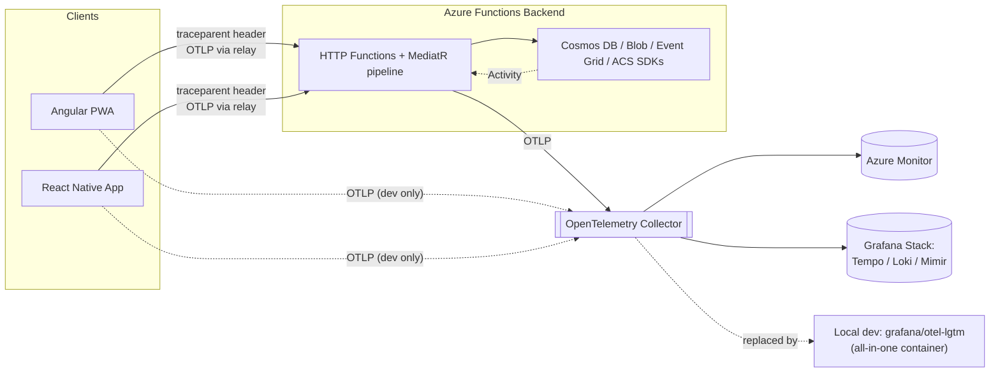

# Telemetry & Observability Plan

> ✅ **Implementation status (2026-07-20): Phases 0–3 are done** — backend OTel SDK wiring,
> request/response redaction + capture, the `errorId` contract, the client relay endpoint, and
> web + mobile trace propagation/error surfacing are all implemented and covered by tests (see
> the per-section notes and the updated §"Rollout Phases" below). Two deliberate deviations
> from the original design, both explained where they occur: (1) `host.json`'s `telemetryMode`
> was **not** flipped to `"OpenTelemetry"` — app-level wiring alone already delivers every
> concrete requirement, and flipping a host-wide runtime switch alongside the existing
> Application Insights SDK wasn't worth the unverified interaction risk; (2) web and mobile use
> a **hand-rolled W3C trace-context utility** instead of the full `@opentelemetry/*` JS SDKs —
> smaller footprint, no new runtime dependencies, and it delivers the same trace propagation +
> errorId correlation the SDK would have. Phases 4–6 (security review sign-off, production
> Collector deployment, alerting) remain open and need infra/security ownership.

## Overview

Today, errors surface to users as a generic message ("Something went wrong") with nothing to hand a developer beyond "it broke around 3pm." There is no way to look at one failed request and see the request body that was sent, the response that came back, which handler it hit, what it did to Cosmos DB, and how long each step took — across backend, web, and mobile.

This plan wires **OpenTelemetry (OTel)** — the vendor-neutral, CNCF-standard observability framework — through all three OurHome surfaces (.NET Azure Functions backend, Angular PWA, React Native mobile app) so that:

1. **Every request produces a trace** — a tree of spans showing every step the request took, including outbound calls to Cosmos DB, Blob Storage, Event Grid, and Azure Communication Services.
2. **Every span carries the request and response bodies** (redacted) as attributes, so "what was sent to the API and what came back" is answered by opening the trace — no separate manual logging to keep in sync.
3. **Every error response includes an `errorId`** that *is* the OpenTelemetry trace ID. A user or a client app can quote that one string, and a developer pastes it into the telemetry UI to land directly on the exact failing request — logs, spans, bodies, and all.
4. **The instrumentation is vendor-neutral.** Apps only ever speak OTLP (the OpenTelemetry wire protocol) to a collector. Swapping or adding backends (Azure Monitor, Grafana Cloud, self-hosted Tempo/Loki, whatever) is a collector config change, not an app code change.

A runnable local telemetry container is included as part of this change (§13) so the plan can be validated today, not just designed.

---

## Guiding Principles

- **One correlation ID, everywhere.** The W3C `traceparent` trace ID is the single identifier that ties together a mobile tap, the API call it triggers, the Cosmos DB query the handler runs, and the log line that says why it failed. We do not invent a second "correlation ID" scheme alongside it.
- **Instrument once, export anywhere.** All three apps use the OpenTelemetry SDK/API and emit OTLP. No app talks directly to Application Insights, Grafana, or any specific vendor SDK — that coupling lives only in the collector's exporter config.
- **Redact before it leaves the process.** Passwords, tokens, OTPs, JWTs, and full contact details are stripped or masked in span/log attributes before they're exported — not after they've landed in a third-party dashboard.
- **Cheap to run locally, same shape in production.** The local dev container (§13) and the production topology (§14) both receive OTLP on the same two ports; only the collector's destination changes.
- **Errors are never silent.** Every unhandled exception and every structured `Result.Failure` gets an `errorId` in the response and a matching span/log entry — there is no code path that fails without leaving a traceable record.

---

## Architecture



- **Local/dev**: apps export straight to the all-in-one `grafana/otel-lgtm` container (§13) — no separate collector needed.
- **Production**: apps export to a centrally-hosted OpenTelemetry Collector, which fans out to Azure Monitor (keeps the existing Application Insights investment) and, optionally, a self-hosted or Grafana Cloud Tempo/Loki/Mimir stack for longer retention and richer trace search (§14).
- The **collector is the only place that knows about specific vendors.** Adding PagerDuty alerting, a second observability vendor, or dropping Application Insights later is a collector config change.

---

## The `errorId` Contract

This is the core of the ask: **the ID a user sees is the ID a developer searches for.**

### Response shape

Every API error response (already standardized via `ExceptionHandlingMiddleware` and `HttpHelpers.ToActionResult`, added in the amenity/complaint bug-fix pass) gains one more field:

```json
{
  "error": "Start time is outside operating hours.",
  "errorCode": "OUTSIDE_OPERATING_HOURS",
  "message": "Start time is outside operating hours.",
  "errorId": "4bf92f3577b34da6a3ce929d0e0e4736",
  "errors": null
}
```

- `errorId` is the **32-character lowercase hex W3C trace ID** (`Activity.Current?.TraceId.ToHexString()`) of the request that failed. It is not a new random GUID — it is literally the trace ID, so pasting it into the telemetry UI's trace search returns the exact request.
- Present on **every** error response — validation failures (422), forbidden (403), not found (404), conflicts (409), and unhandled exceptions (500) alike. A validation error is just as traceable as a crash.
- If, for some reason, no `Activity` is active (extremely unlikely once instrumentation is wired — only a startup-time failure before the pipeline runs), `errorId` falls back to a freshly generated GUID and that GUID is logged alongside the exception so it's still searchable by full-text log search even without a trace.
- ✅ **Implemented** as `ApartmentManagement.Functions.Helpers.ErrorIdProvider.Current`, used by both `ExceptionHandlingMiddleware` (all 3 branches) and every failure branch of `HttpHelpers.ToActionResult`/`ToValidationErrorResponse`/`ToAppErrorResponse`. As a side effect of touching every branch, the previously bare `{ error: msg }` payloads (NotFound, Conflict, Forbidden, Unauthorized, generic 500, etc.) now also carry `errorCode` — a small, additive, backward-compatible consistency fix alongside the errorId work. Covered by `HttpHelpersErrorIdTests` (12 error-code cases + the success path) in `backend_unittest/ApartmentManagement.Tests.L1/TelemetryTests.cs`.

### What clients do with it

| Surface | Behavior |
|---|---|
| **Web** | Error snackbar gains a "Copy error ID" action button (instead of "Dismiss") for network/5xx/unexpected errors. Validation/business errors (4xx with a human message) show the message as today with a plain "Dismiss". |
| **Mobile** | `normalizeError()` extracts `errorId` from the response and appends it to the alert body on unexpected errors: *"An unexpected error occurred. (Ref: 4bf92f35…)"*. Business-rule errors show the plain message as today. |
| **Support / on-call** | Paste the `errorId` into Grafana → Explore → Tempo → **Trace ID** search (local/dev) or the equivalent Azure Monitor / Grafana Cloud trace search (production). Lands directly on the failing request's full trace: every span, every dependency call, the request/response bodies, and the exact log line with the stack trace. |

---

## Backend (.NET Azure Functions) Instrumentation

### Packages

✅ **Implemented** — resolved via `dotnet add package` (no version pinned in the doc originally; NuGet resolved current stable `1.17.0` at implementation time):

```xml
<PackageReference Include="OpenTelemetry.Extensions.Hosting" Version="1.17.0" />
<PackageReference Include="OpenTelemetry.Instrumentation.AspNetCore" Version="1.17.0" />
<PackageReference Include="OpenTelemetry.Instrumentation.Http" Version="1.17.0" />
<PackageReference Include="OpenTelemetry.Instrumentation.Runtime" Version="1.17.0" />
<PackageReference Include="OpenTelemetry.Exporter.OpenTelemetryProtocol" Version="1.17.0" />
```

`Microsoft.ApplicationInsights.WorkerService` and `Microsoft.Azure.Functions.Worker.ApplicationInsights` (already referenced) are **kept as-is** — the classic App Insights SDK keeps shipping host-level function/trigger telemetry unchanged, and the OTel pipeline below is deliberately **never** wired to export directly to Azure Monitor from the app (only OTLP, see the exporter config below) specifically to avoid double-reporting the same requests to the same App Insights resource through two different collection mechanisms. The `Serilog.Extensions.Logging` / `Serilog.Sinks.ApplicationInsights` packages, which were referenced but never wired up anywhere (`UseSerilog()` was never called), have been **removed** from both `ApartmentManagement.Functions.csproj` and `ApartmentManagement.Infrastructure.csproj` — `ILogger<T>` now flows through the OTel Logs bridge instead (see below).

### Two levels of instrumentation

**1. Host-level.** ⚠️ **Deliberately not implemented.** `host.json`'s `telemetryMode: "OpenTelemetry"` switch was considered but **not** set — this repo's `func`/Functions host version and its interaction with the already-registered classic Application Insights Worker Service SDK couldn't be verified at implementation time (Microsoft's guidance is explicit that combining the classic AI SDK with OTel-based collection against the same resource risks duplicate telemetry), and flipping a host-wide runtime mode without being able to validate the actual runtime behavior was judged too risky for an additive change. App-level wiring (below) already delivers 100% of the concrete requirements — body capture, errorId, dependency spans — without touching this switch. Revisiting this is a reasonable, low-risk follow-up once it can be validated against a real running host.

**2. App-level (implemented).** `Program.cs` registers the OTel SDK additively alongside the existing Application Insights registration:

```csharp
services.AddOpenTelemetry()
    .ConfigureResource(r => r.AddService(serviceName: otelServiceName, serviceVersion: ...))
    .WithTracing(tracing =>
    {
        tracing
            .AddSource("Azure.*")               // Cosmos/Blob/EventGrid/ACS dependency spans
            .AddSource("OurHome.ClientRelay")   // web/mobile-forwarded client events (§ relay)
            .AddAspNetCoreInstrumentation()
            .AddHttpClientInstrumentation();
        if (!string.IsNullOrWhiteSpace(otlpEndpoint))
            tracing.AddOtlpExporter(o => o.Endpoint = new Uri(otlpEndpoint));
    })
    .WithMetrics(metrics => { /* AddAspNetCoreInstrumentation + AddRuntimeInstrumentation, same OTLP-if-configured pattern */ })
    .WithLogging(logging => { /* OTLP-if-configured — this is what makes ILogger<T> calls flow through automatically */ });
```

`otlpEndpoint` and `otelServiceName` are read from `Infrastructure:OtelExporterOtlpEndpoint` / `Infrastructure:OtelServiceName` config (new `InfrastructureSettings` properties) — empty endpoint means spans/errorIds still work locally, they just aren't exported anywhere. `local.settings.json` defaults `OtelExporterOtlpEndpoint` to `http://localhost:4318`, matching the dev container in §13, so `func start` + `docker compose up -d` "just works" with zero extra config.

Azure SDK clients (Cosmos DB, Blob Storage, Event Grid) emit their own `System.Diagnostics.Activity` spans once this switch is on, set at the very top of `Program.cs` before the host is built:

```csharp
AppContext.SetSwitch("Azure.Experimental.EnableActivitySource", true);
```

so `AddSource("Azure.*")` picks up a `Cosmos.Query` / `Cosmos.CreateItem` / `Blob.Upload` child span under every request, each with duration and status — answering "was the slow part my code or Cosmos?" without extra logging.

### Request/response body capture

✅ **Implemented** as `TelemetryEnrichmentMiddleware`, registered after `HttpContextAccessorMiddleware` and inside `ExceptionHandlingMiddleware` in `Program.cs`'s middleware chain:

- Buffers the request body via `EnableBuffering()` + rewinds `Position` after reading, so the function body's own `HttpHelpers.DeserializeAsync` call still sees a fresh stream — no double-read cost or conflict — and sets it as a span attribute `http.request.body`.
- Wraps `HttpContext.Response.Body` in a `MemoryStream`, so after the function completes the response payload is readable as `http.response.body`, then copies it back to the real response stream in a `finally` block regardless of success or exception.
- Runs the **redaction pass** (`TelemetryRedactor`, §8) over both before attaching them.
- Truncates both to **8 KB** (`TelemetryRedactor.MaxBodyBytes`) — large/multipart payloads are recorded as `<omitted: {contentType}, {size} bytes>` rather than inlined; the size and content-type are always captured even when the body isn't.
- Also stamps `enduser.id`, `society.id`, and `enduser.role` (from `ICurrentUserService`) on the span when the caller is authenticated, so "show me every request from this user" is a one-line trace-backend query.
- Note: error response bodies (written by `ExceptionHandlingMiddleware`, which sits *outside* this middleware) aren't captured as a span attribute — but the errorId, error code, and full exception are already in the structured log line for that same trace, so nothing is actually lost.

### `ExceptionHandlingMiddleware` — one small addition

The middleware added in the amenity-booking bug fix already maps every `AppException`/unhandled exception to a structured `{error, errorCode, message}` payload. This plan adds the `errorId` field:

```csharp
var traceId = Activity.Current?.TraceId.ToHexString() ?? Guid.NewGuid().ToString("N");
payload = payload with { ErrorId = traceId }; // reflected in every branch of the switch
logger.LogError(ex, "Unhandled exception in {Function} (errorId={ErrorId})",
    context.FunctionDefinition.Name, traceId);
```

Because `ILogger` calls inside an active `Activity` are automatically correlated by the OTel Logs exporter, the log line and the trace show up linked in the UI without any extra plumbing.

### Structured logging

`ILogger<T>` usage across the codebase (already extensive — `LoggingBehavior`, every handler's catch block) needs no call-site changes. The OTel Logging provider (`WithLogging(...)` above) picks up every `ILogger` call, attaches the current trace context automatically, and exports it as an OTel LogRecord — visible in Grafana Loki (or Azure Monitor traces/logs) already correlated to the request's trace.

### Client telemetry relay endpoint

✅ **Implemented** as `TelemetryFunctions.SubmitClientTelemetry` (`Http/Telemetry/TelemetryFunctions.cs`) — `POST /api/telemetry/client-events`, authenticated (`ICurrentUserService.IsAuthenticated` check, same as every other endpoint), gated by `Infrastructure:TelemetryRelayEnabled` (defaults on). Each event in the batch (capped at 50 per request — untrusted client input) is re-emitted as an `Activity` on a dedicated `OurHome.ClientRelay` source, parented to the client's own `traceId`/`spanId` when they parse as valid W3C hex (falls back to rooting under the current request's own trace if the client sent something malformed, rather than failing the batch). `ErrorMessage`, `Url`, and `Attributes` all run through `TelemetryRedactor` before becoming span tags. Covered by `TelemetryFunctionsParsingTests` in the same test file as the redaction/errorId tests, exercising the untrusted-input parsing (`TryParseContext`/`IsHex`/`SanitizeName`, made `internal` + `InternalsVisibleTo` specifically so this logic is directly testable).

---

## Frontend (Angular Web) Instrumentation

> ✅ **Implemented — with one deliberate architecture change from the original plan below.**
> Rather than the full `@opentelemetry/sdk-trace-web` + fetch/XHR auto-instrumentation stack,
> the implementation uses a **hand-rolled W3C trace-context utility** (`core/services/trace-context.ts`
> — ~30 lines, `crypto.getRandomValues` + hex encoding, zero new npm dependencies). Reasoning:
> the actual requirement is "outgoing requests carry a `traceparent` header the backend
> continues as the same trace, and errors are correlatable by ID" — the full SDK's extra value
> (auto-instrumentation of every fetch/XHR call site, browser span export, OTel Logs API) isn't
> needed once the relay pattern (below) is the only client→server telemetry path anyway. This
> can be swapped for the full SDK later without changing the wire contract (the backend just
> sees a `traceparent` header either way) if richer client-side spans become worth the
> dependency weight.

### What's implemented instead

| Original plan | Implementation |
|---|---|
| `@opentelemetry/sdk-trace-web` + `instrumentation-fetch` | `core/services/trace-context.ts` — `createTraceContext()` generates a W3C-shaped `{traceId, spanId, header}`; `traceIdFromHeader()` parses one back out |
| Auto-instrumented fetch/XHR | `core/interceptors/telemetry.interceptor.ts` — a functional `HttpInterceptorFn` that clones every outgoing request with a fresh `traceparent` header |
| `@opentelemetry/exporter-trace-otlp-http` (client-side OTLP) | `core/services/telemetry.service.ts` — `reportClientEvent()` POSTs to the relay endpoint via the existing authenticated `HttpClient` pipeline (not raw OTLP) |
| OTel span event on error | `core/interceptors/error.interceptor.ts` extracts `errorId` and surfaces it |

### Trace propagation

`telemetryInterceptor` is registered in `app.config.ts`'s interceptor chain as `[authInterceptor, telemetryInterceptor, errorInterceptor]` — after auth (so the JWT is already attached) and before the error interceptor (so the traceparent header is already on `req` by the time error handling needs to read it back for the network-failure fallback). Every outgoing API call gets a fresh `traceparent` header — the backend's `AddAspNetCoreInstrumentation()` picks it up and continues the **same trace**, so a click in the browser and the Cosmos query it triggers show up as one connected trace, not two disconnected ones.

### Client → collector path: relay, not direct

Implemented exactly as planned — browsers never talk to the OTLP collector directly (that would require accepting public, unauthenticated, CORS-enabled traffic from anyone's browser). `telemetryInterceptor` calls `TelemetryService.reportClientEvent()` specifically (and only) when `err.status === 0` — a pure network failure where the request never reached the backend at all, the one case nothing server-side will ever record on its own. Normal HTTP error responses need no separate relay call: the server already continued the same trace and already returned an `errorId`, so there's nothing additional to forward. The interceptor explicitly skips instrumenting/reporting calls to the relay endpoint itself (`req.url.includes(TELEMETRY_RELAY_PATH)`) to avoid a reporting loop.

### Error boundary

`error.interceptor.ts` extracts the errorId (`err.error?.errorId` when the server responded; falls back to `traceIdFromHeader(req.headers.get('traceparent'))` for network failures) and surfaces it via the snackbar's action button: **"Copy error ID"** (writes to `navigator.clipboard`, with `.catch(() => {})` since clipboard access can legitimately reject) instead of the default "Dismiss" — but only for unexpected/unattributable failures (network errors, 5xx, or an unmapped fallback status). Handled cases with a specific, self-explanatory message (401 session-expired, 403 forbidden, 403 society-disabled, 404 not-found) keep the plain "Dismiss" button, matching the original plan's "4xx with a human message shows the message as today" intent.

---

## Mobile (React Native) Instrumentation

> ✅ **Implemented — same "manual tracer, no new dependency" choice as web, even more minimal
> than originally planned.** Rather than `@opentelemetry/sdk-trace-base` + `exporter-trace-otlp-http`,
> the implementation is a pure hand-rolled `traceContext.ts` (`Math.random()`-based hex
> generation, not `expo-crypto`/Web Crypto — a trace ID only needs to be collision-resistant
> for correlation, not cryptographically unpredictable, so pulling in a native crypto module
> wasn't justified). Zero new npm packages, nothing to native-rebuild for.

- `shared/utils/traceContext.ts` — mirrors the web utility exactly (`createTraceContext()`, `traceIdFromHeader()`), same W3C shape, different (non-crypto) random source.
- `api/client.ts`'s existing axios request interceptor now also stamps a fresh `traceparent` header on every outgoing call (skipped for calls to the relay endpoint itself). `reportClientEvent()` lives in the **same file** rather than a separate module specifically to avoid a circular import (`client.ts`'s own response interceptor needs to call it for network-failure reporting; a separate telemetry module would need to import the same `api` instance back from `client.ts`).
- The response interceptor reports to the relay only for a pure network failure (`!error.response` — axios's equivalent of the web's `status === 0`), extracting the trace ID back off the failed request's own `traceparent` header via `traceIdFromHeader`. Calls to the relay endpoint itself are excluded from this reporting to avoid a loop.
- `normalizeError()` (`shared/utils/errors.ts`) surfaces the errorId as `"{message} (Ref: {errorId})"` — but, matching the web app's nuance, **only** for unexpected failures (no response at all, or a 5xx). A handled 4xx already has a specific, actionable message from the backend and doesn't get the reference appended. Every screen's existing `Alert.alert('Error', normalizeError(e))` call picks this up automatically, no per-screen changes needed.

This mirrors the web app's structure closely enough that the *redaction* logic is genuinely shared (the relay endpoint runs the exact same `TelemetryRedactor` regardless of which client sent the event) — the trace-context generation itself is duplicated (not literally shared code, since web and mobile are separate npm packages with no shared module boundary in this repo), kept deliberately identical in shape between the two copies.

---

## Redaction & PII Rules

✅ **Implemented** as `ApartmentManagement.Functions.Helpers.TelemetryRedactor` — one shared static class used by both `TelemetryEnrichmentMiddleware` (server-side request/response capture) and `TelemetryFunctions` (client-forwarded events from the relay), so web/mobile/backend all get the identical treatment. Covered by 12 table-driven tests in `TelemetryRedactorTests`.

| Rule | Detail |
|---|---|
| **Never-log field names** (case-insensitive, recursive through JSON) | `password`, `newPassword`, `currentPassword`, `confirmPassword`, `otp`, `code`, `token`, `accessToken`, `refreshToken`, `idToken`, `jwtSecret`, `secret`, `apiKey`, `sasToken`, `connectionString` — value replaced with `"***REDACTED***"` |
| **Masked, not dropped** | `phone`, `phoneNumber`, `visitorPhone`, `vehicleNumber`, `email`, `visitorEmail`, `contactEmail` — the exact same masking algorithm already used for the resident directory (`+91-98XXXXXX10`, `ra***@***.com`), duplicated (not reused via a cross-layer dependency) into `TelemetryRedactor` since Functions has no other reason to depend on the Application layer |
| **Headers** | ⚠️ **Narrower than originally planned.** `TelemetryEnrichmentMiddleware` doesn't capture full request/response headers at all (only content-type/length are read, never attached as span attributes) — so there was nothing to strip `Authorization`/`Cookie`/`Set-Cookie` *from* in the first place. If header capture is added later, this redaction rule still needs implementing at that point. |
| **Binary/large payloads** | multipart/form-data, and any body over 8 KB (`TelemetryRedactor.MaxBodyBytes`), replaced with `<omitted: {contentType}, {size} bytes>` |
| **Blob URLs** | app-relative authenticated paths already used across the app (not raw SAS URLs) are safe to log as-is; if a raw SAS-looking URL (`sig=`/`&se=` query params) ever appears in a body, the query string is stripped before logging — applied recursively to every string value in the JSON tree, not just recognized field names |

---

## Correlation Across the Stack — Worked Example

**Scenario A — an unexpected failure (shows the Ref to the user).** A resident's amenity booking hits a transient Cosmos DB timeout:

1. Mobile: `AmenityBookingScreen` calls `createBooking(...)`. The axios request interceptor generates trace ID `4bf92f35…` and attaches it as the `traceparent` header.
2. Backend: `AddAspNetCoreInstrumentation()` sees the incoming `traceparent`, continues the same trace. `TelemetryEnrichmentMiddleware` attaches the (redacted) request body. `BookAmenityCommandHandler` throws; `ExceptionHandlingMiddleware` catches it, maps it to a 500 with `errorId = "4bf92f35…"` — **the same trace ID**, no new ID minted — and logs the exception with that same errorId.
3. Mobile: `normalizeError()` sees a 5xx with a server `errorId`, shows *"An unexpected error occurred. (Ref: 4bf92f35…)"*.
4. Support pastes `4bf92f35…` into Grafana → Explore → Tempo. One trace: the mobile call's span, the backend request span with the exact redacted request body that was sent, the Cosmos dependency span showing the timeout, and — because `WithLogging` correlates automatically — the matching `ILogger` line with the full exception, all in one screen. No log-grepping, no "what time did you try this," no guessing.

**Scenario B — an expected business-rule rejection (no Ref shown, by design).** The same booking instead fails because the chosen slot is outside operating hours: `BookAmenityCommandHandler` returns `Result.Failure(OUTSIDE_OPERATING_HOURS, ...)`, `HttpHelpers.ToActionResult` maps it to a 400 that *does* still carry an `errorId` in the payload (every error response does), but `normalizeError()` deliberately doesn't surface it for a handled 4xx — the resident just sees *"Start time is outside operating hours."* This is a validation message they can act on themselves; escalating it to support with a reference ID would be noise. The trace is still fully there and still gets pulled up correctly if support ever needs it for another reason (e.g. "why did this user's booking keep failing") — it's just not pushed into the user-facing message for this class of error.

---

## Sampling, Retention, and Cost Controls

⚠️ **Not implemented in this pass** — the OTel SDK is currently registered with its default sampler (effectively "always on" when an OTLP endpoint is configured, no export at all when it isn't). Explicit sampling policy is Phase 5 work, described below for when that phase is scheduled:

- **Local/dev** (§13): no sampling — capture everything, retention is whatever disk space allows (best-effort, ephemeral by design).
- **Production** (§14):
  - **Head-based sampling at the SDK**: 100% of error traces (any span with an exception or status ≥ 400) always sampled; successful traces sampled at a configurable rate (start at 10%, tune from real traffic volume). This guarantees **every** `errorId` a user sees is actually retrievable — never sampled away — while keeping cost bounded on the happy path.
  - **Collector-side tail sampling** (optional, phase 2 of production rollout) can additionally boost sampling for slow requests (p95+) even if they succeeded, useful for performance investigations without raising the baseline rate.
  - **Retention**: Application Insights per the existing workspace's retention policy (unchanged); if a self-hosted/Grafana Cloud Tempo+Loki path is added, target 14–30 days for traces/logs, longer for aggregated metrics.

---

## Alerting (Future — Not Built in This Pass)

Once the collector is live in production, cheap wins to layer on top:

- Alert on `errorId`-bearing 5xx rate exceeding a threshold over 5 minutes.
- Alert on a specific `errorCode` spiking (e.g., a sudden burst of `BOOKING_CONFLICT` might mean a client-side bug is retrying, not a real usage spike).
- Alert on the `OutboxPublisher` timer function's backlog size (already flagged as a gap in `tech_requirements.md`) — now trivial to wire since the timer function is already emitting spans.

---

## "For Now": Local/Dev Telemetry Container

A runnable container is included alongside this plan: **`infra/observability/docker-compose.yml`**.

It runs `grafana/otel-lgtm` — a single Grafana-maintained image bundling an OTLP receiver, Tempo (traces), Loki (logs), Prometheus (metrics), and a pre-provisioned Grafana UI with all three data sources wired up. This is the fastest path to "see a real trace with a real request body" without standing up four separate services.

### Start it

```bash
cd infra/observability
docker compose up -d
```

- Grafana UI: **http://localhost:3000** (`admin` / `admin`, change on first login)
- OTLP gRPC: **http://localhost:4317**
- OTLP HTTP: **http://localhost:4318**

### Local wiring

✅ **Backend is wired**; web and mobile need no separate OTLP config at all — since they use the relay pattern (§"Client → collector path"), they only need to reach the *backend API* (already configured via the existing `environment.apiBaseUrl` / `API_BASE_URL`), which in turn is the only thing that talks OTLP to the container:

| App | Config | Value (local) | Status |
|---|---|---|---|
| Backend (`local.settings.json`) | `Infrastructure:OtelExporterOtlpEndpoint` | `http://localhost:4318` | ✅ set as the default |
| Backend | `Infrastructure:OtelServiceName` | `ourhome-functions` | ✅ set as the default |
| Web | *(none needed)* | reuses existing `environment.apiBaseUrl` for the relay call | ✅ n/a by design |
| Mobile | *(none needed)* | reuses existing `API_BASE_URL` for the relay call | ✅ n/a by design |

### Verify it end to end

1. Trigger any API error locally (e.g., book an amenity outside operating hours).
2. Copy the `errorId` from the response.
3. Grafana → **Explore** → select the **Tempo** data source → **Trace ID** search → paste the `errorId`.
4. Confirm: the trace renders, spans show the request/response body attributes (redacted), and the "Logs for this span" link surfaces the matching structured log line.

This is a **dev/local tool only** — see §14 for the production topology. Do not expose ports 3000/4317/4318 on a machine reachable from the internet.

---

## Path to Production

The local container is replaced by a centrally-hosted **OpenTelemetry Collector** (not the all-in-one image — a purpose-built collector deployment), so the topology looks like:

```
Apps (backend + web relay + mobile relay)
   │  OTLP, mTLS or APIM-fronted with a subscription key
   ▼
OpenTelemetry Collector  (Azure Container Apps or AKS, private ingress)
   │
   ├──▶ Azure Monitor Exporter ──▶ existing Application Insights workspace
   │        (keeps current dashboards/alerts working unchanged)
   │
   └──▶ OTLP Exporter ──▶ Grafana Cloud or self-hosted Tempo/Loki/Mimir
            (optional — richer trace search / longer retention than App Insights' default)
```

Example collector config sketch (for the infra team to adapt when this phase is scheduled):

```yaml
receivers:
  otlp:
    protocols:
      grpc: { endpoint: 0.0.0.0:4317 }
      http: { endpoint: 0.0.0.0:4318 }

processors:
  batch: {}
  attributes/redact:
    actions:
      - key: http.request.body
        action: hash  # extra defense-in-depth on top of app-level redaction
  tail_sampling:
    policies:
      - name: errors-always
        type: status_code
        status_code: { status_codes: [ERROR] }
      - name: baseline-10pct
        type: probabilistic
        probabilistic: { sampling_percentage: 10 }

exporters:
  azuremonitor:
    connection_string: ${env:APPLICATIONINSIGHTS_CONNECTION_STRING}
  otlphttp/grafana:
    endpoint: ${env:GRAFANA_CLOUD_OTLP_ENDPOINT}
    headers: { authorization: "Basic ${env:GRAFANA_CLOUD_TOKEN}" }

service:
  pipelines:
    traces: { receivers: [otlp], processors: [batch, tail_sampling], exporters: [azuremonitor, otlphttp/grafana] }
    logs:   { receivers: [otlp], processors: [batch],                exporters: [azuremonitor, otlphttp/grafana] }
    metrics:{ receivers: [otlp], processors: [batch],                exporters: [azuremonitor] }
```

**Infra additions this implies** (tracked as follow-up, not part of this plan's immediate scope): a new Bicep module for the Collector's hosting (Container Apps is the natural fit — matches the "serverless, scale-to-zero where possible" posture of the rest of the platform), a Key Vault secret for the Grafana Cloud token (if that path is chosen), and an APIM route or private endpoint so the Collector is never directly internet-facing.

---

## Rollout Phases

| Phase | Scope | Status |
|---|---|---|
| **0** | This plan; local dev container (`infra/observability/docker-compose.yml`) | ✅ Done |
| **1 — Backend instrumentation** | OTel SDK wiring in `Program.cs`; `TelemetryEnrichmentMiddleware`; `TelemetryRedactor`; `errorId` added to `ExceptionHandlingMiddleware` and every `HttpHelpers` error branch; Azure SDK Activity sources enabled; client relay endpoint (`TelemetryFunctions`) | ✅ Done — 50 new backend tests (`TelemetryTests.cs`), full solution builds clean, L0 316/316 + L1 380/380 pass |
| **2 — Web instrumentation** | Trace propagation (`telemetry.interceptor.ts`); error interceptor `errorId` surfacing with a "Copy error ID" snackbar action; relay forwarding for network failures | ✅ Done — using a hand-rolled trace-context utility instead of the full OTel Web SDK (see §"Frontend Instrumentation" for why); 19 new tests, 285/285 web tests pass, production build clean |
| **3 — Mobile instrumentation** | Manual tracer (`traceContext.ts`); axios interceptor tracing in `api/client.ts`; `normalizeError()` `errorId` surfacing | ✅ Done — 24 new tests, 263/263 mobile tests pass, `tsc --noEmit` clean |
| **4 — Redaction hardening + review** | Security review of the redaction rules against real captured payloads before any production rollout | ⚠️ **Open** — needs a human security sign-off before production use; automated tests cover the documented rules but haven't been reviewed against real production-shaped payloads |
| **5 — Production topology** | Collector deployment (Bicep), Azure Monitor + optional Grafana Cloud export, sampling policy, retire the local-only wiring path for deployed environments | ⚠️ **Open** — deliberately out of scope for this pass; no Bicep changes were made |
| **6 — Alerting** | Error-rate, error-code-spike, and outbox-backlog alerts on top of the now-live collector | ⚠️ **Open** — depends on Phase 5 |

---

## Testing & Validation Plan

- ✅ **Backend** (`backend_unittest/ApartmentManagement.Tests.L1/TelemetryTests.cs`, 50 tests): `TelemetryRedactorTests` (table-driven — every never-log field, phone/email masking, nested objects/arrays, multipart/oversized summarization, SAS URL stripping, non-JSON passthrough); `ErrorIdProviderTests` (shape contract + active-Activity correlation); `HttpHelpersErrorIdTests` (all 12 mapped error codes carry a valid errorId at the right status); `TelemetryFunctionsParsingTests` (the relay's untrusted-client-input parsing — malformed trace/span IDs, uppercase hex rejection, name-length capping).
- ✅ **Web** (`error.interceptor.spec.ts`, `telemetry.interceptor.spec.ts`, `trace-context.spec.ts`, 19 tests): traceparent header shape/uniqueness, header propagation through the interceptor chain, "Copy error ID" vs. "Dismiss" action selection per status code, network-failure relay reporting, no-reporting-loop guard.
- ✅ **Mobile** (`__tests__/api/client.test.ts` extension, `traceContext.test.ts`, `errors.test.ts`, 24 tests): same coverage shape as web, adapted for axios's config/interceptor model.
- ⚠️ **Manual E2E check** (documented in §13's "Verify it end to end") — **not run in this pass**: it requires the local dev container actually running (`docker compose up -d`) and a live `func start`/`ng serve` session, which wasn't exercised end-to-end here. The automated tests above cover every piece in isolation (redaction rules, errorId presence/shape, trace propagation, relay guards) but the full "trigger a real error → see a real trace in Grafana" loop should be walked through manually before calling Phase 1–3 fully validated.
- ⚠️ **Load test sanity check** before Phase 5: confirm sampling keeps the Collector's throughput and the production Application Insights ingestion volume within expected bounds — blocked on Phase 5 (sampling isn't implemented yet either, see above).

---

## Open Decisions

These need a sign-off before Phase 5 (production) is scheduled — noted here rather than decided unilaterally:

1. **Grafana Cloud vs. self-hosted Tempo/Loki/Mimir vs. Azure Monitor only.** Azure Monitor alone is the zero-new-infra option (keeps today's App Insights workspace as the only backend) but has weaker trace-search ergonomics than Tempo/Grafana. Recommendation: start Azure-Monitor-only for Phase 5, add the Grafana path only if trace search becomes a real pain point.
2. **Collector hosting cost/ops ownership** — Container Apps consumption plan is the natural default given the rest of the platform is Consumption-plan Functions, but needs a cost estimate added to `infra/COST_ESTIMATE.md` once Phase 5 is scheduled.
3. **Sampling rate for successful traces** (10% suggested above) — should be tuned against real production traffic volume once Phase 1 is live in a non-prod environment, not guessed in advance.
