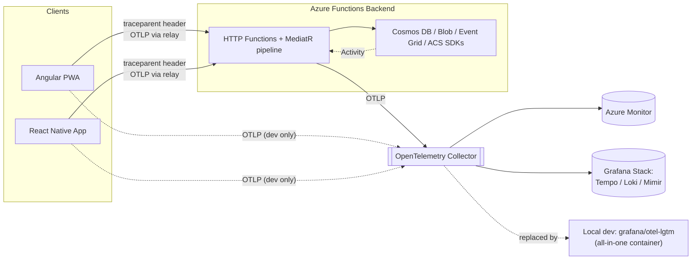

# Telemetry & Observability Plan

## Overview

Today, errors surface to users as a generic message ("Something went wrong") with nothing to hand a developer beyond "it broke around 3pm." There is no way to look at one failed request and see the request body that was sent, the response that came back, which handler it hit, what it did to Cosmos DB, and how long each step took — across backend, web, and mobile.

This plan wires **OpenTelemetry (OTel)** — the vendor-neutral, CNCF-standard observability framework — through all three OurHome surfaces (.NET Azure Functions backend, Angular PWA, React Native mobile app) so that:

1. **Every request produces a trace** — a tree of spans showing every step the request took, including outbound calls to Cosmos DB, Blob Storage, Event Grid, and Azure Communication Services.
2. **Every span carries the request and response bodies** (redacted) as attributes, so "what was sent to the API and what came back" is answered by opening the trace — no separate manual logging to keep in sync.
3. **Every error response includes an `errorId`** that *is* the OpenTelemetry trace ID. A user or a client app can quote that one string, and a developer pastes it into the telemetry UI to land directly on the exact failing request — logs, spans, bodies, and all.
4. **The instrumentation is vendor-neutral.** Apps only ever speak OTLP (the OpenTelemetry wire protocol) to a collector. Swapping or adding backends (Azure Monitor, Grafana Cloud, self-hosted Tempo/Loki, whatever) is a collector config change, not an app code change.

A runnable local telemetry container is included as part of this change (§13) so the plan can be validated today, not just designed.

---

## Guiding Principles

- **One correlation ID, everywhere.** The W3C `traceparent` trace ID is the single identifier that ties together a mobile tap, the API call it triggers, the Cosmos DB query the handler runs, and the log line that says why it failed. We do not invent a second "correlation ID" scheme alongside it.
- **Instrument once, export anywhere.** All three apps use the OpenTelemetry SDK/API and emit OTLP. No app talks directly to Application Insights, Grafana, or any specific vendor SDK — that coupling lives only in the collector's exporter config.
- **Redact before it leaves the process.** Passwords, tokens, OTPs, JWTs, and full contact details are stripped or masked in span/log attributes before they're exported — not after they've landed in a third-party dashboard.
- **Cheap to run locally, same shape in production.** The local dev container (§13) and the production topology (§14) both receive OTLP on the same two ports; only the collector's destination changes.
- **Errors are never silent.** Every unhandled exception and every structured `Result.Failure` gets an `errorId` in the response and a matching span/log entry — there is no code path that fails without leaving a traceable record.

---

## Architecture



- **Local/dev**: apps export straight to the all-in-one `grafana/otel-lgtm` container (§13) — no separate collector needed.
- **Production**: apps export to a centrally-hosted OpenTelemetry Collector, which fans out to Azure Monitor (keeps the existing Application Insights investment) and, optionally, a self-hosted or Grafana Cloud Tempo/Loki/Mimir stack for longer retention and richer trace search (§14).
- The **collector is the only place that knows about specific vendors.** Adding PagerDuty alerting, a second observability vendor, or dropping Application Insights later is a collector config change.

---

## The `errorId` Contract

This is the core of the ask: **the ID a user sees is the ID a developer searches for.**

### Response shape

Every API error response (already standardized via `ExceptionHandlingMiddleware` and `HttpHelpers.ToActionResult`, added in the amenity/complaint bug-fix pass) gains one more field:

```json
{
  "error": "Start time is outside operating hours.",
  "errorCode": "OUTSIDE_OPERATING_HOURS",
  "message": "Start time is outside operating hours.",
  "errorId": "4bf92f3577b34da6a3ce929d0e0e4736",
  "errors": null
}
```

- `errorId` is the **32-character lowercase hex W3C trace ID** (`Activity.Current?.TraceId.ToHexString()`) of the request that failed. It is not a new random GUID — it is literally the trace ID, so pasting it into the telemetry UI's trace search returns the exact request.
- Present on **every** error response — validation failures (422), forbidden (403), not found (404), conflicts (409), and unhandled exceptions (500) alike. A validation error is just as traceable as a crash.
- If, for some reason, no `Activity` is active (extremely unlikely once instrumentation is wired — only a startup-time failure before the pipeline runs), `errorId` falls back to a freshly generated GUID and that GUID is logged alongside the exception so it's still searchable by full-text log search even without a trace.

### What clients do with it

| Surface | Behavior |
|---|---|
| **Web** | Error snackbar gains a small "Copy error ID" affordance for 5xx/unexpected errors: *"Something went wrong. [Copy error ID]"*. Validation/business errors (4xx with a human message) show the message as today, with the ID available on hover/expand for support escalation. |
| **Mobile** | `normalizeError()` extracts `errorId` from the response and appends it to the alert body on unexpected errors: *"Server error. Reference: 4bf92f35…"*. Business-rule errors show the plain message as today. |
| **Support / on-call** | Paste the `errorId` into Grafana → Explore → Tempo → **Trace ID** search (local/dev) or the equivalent Azure Monitor / Grafana Cloud trace search (production). Lands directly on the failing request's full trace: every span, every dependency call, the request/response bodies, and the exact log line with the stack trace. |

---

## Backend (.NET Azure Functions) Instrumentation

### Packages

```xml
<PackageReference Include="OpenTelemetry.Extensions.Hosting" Version="1.9.0" />
<PackageReference Include="OpenTelemetry.Instrumentation.AspNetCore" Version="1.9.0" />
<PackageReference Include="OpenTelemetry.Instrumentation.Http" Version="1.9.0" />
<PackageReference Include="OpenTelemetry.Instrumentation.Runtime" Version="1.9.0" />
<PackageReference Include="OpenTelemetry.Exporter.OpenTelemetryProtocol" Version="1.9.0" />
```

`Microsoft.ApplicationInsights.WorkerService` and `Microsoft.Azure.Functions.Worker.ApplicationInsights` (currently referenced) are **kept for now** — Application Insights stays as one of the collector's export destinations (§14), reached via the collector's Azure Monitor exporter rather than the app talking to it directly. The `Serilog.Extensions.Logging` / `Serilog.Sinks.ApplicationInsights` packages are referenced but **not currently wired up anywhere** (`UseSerilog()` is never called) — this plan retires them rather than adding a second logging pipeline; `ILogger<T>` flows through the OTel Logs bridge instead (see below).

### Two levels of instrumentation

**1. Host-level (free, one setting).** The Azure Functions host itself (v4.28+) can emit OTel signals for triggers/bindings natively:

```json
// host.json
{
  "version": "2.0",
  "telemetryMode": "OpenTelemetry",
  "logging": {
    "logLevel": { "default": "Information" }
  }
}
```

Combined with the standard OTel environment variables (`OTEL_EXPORTER_OTLP_ENDPOINT`, `OTEL_SERVICE_NAME`) this gets host-level request/trigger telemetry flowing with no code change. It does **not** by itself capture request/response bodies — that needs the app-level middleware below.

**2. App-level (custom spans + body capture).** `Program.cs` registers the OTel SDK for everything the host-level mode doesn't cover — Cosmos/Blob/EventGrid/ACS dependency spans, custom attributes, and the request/response body enrichment:

```csharp
services.AddOpenTelemetry()
    .ConfigureResource(r => r.AddService(
        serviceName: "ourhome-functions",
        serviceVersion: typeof(Program).Assembly.GetName().Version?.ToString()))
    .WithTracing(tracing => tracing
        .AddSource("OurHome.*")                 // our own ActivitySource(s)
        .AddAspNetCoreInstrumentation()          // works via the existing HttpContext bridge
        .AddHttpClientInstrumentation()          // outbound HTTP (ACS, etc.)
        .AddOtlpExporter())
    .WithMetrics(metrics => metrics
        .AddAspNetCoreInstrumentation()
        .AddRuntimeInstrumentation()
        .AddOtlpExporter())
    .WithLogging(logging => logging.AddOtlpExporter());
```

Azure SDK clients (Cosmos DB, Blob Storage, Event Grid) already emit `System.Diagnostics.Activity` spans internally — enable them with:

```csharp
AppContext.SetSwitch("Azure.Experimental.EnableActivitySource", true);
```

so `AddSource("Azure.*")` picks up a `Cosmos.Query` / `Cosmos.CreateItem` / `Blob.Upload` child span under every request, each with duration and status — answering "was the slow part my code or Cosmos?" without extra logging.

### Request/response body capture

A new `TelemetryEnrichmentMiddleware` (function-worker middleware, alongside the existing `HttpContextAccessorMiddleware` and `ExceptionHandlingMiddleware`):

- Buffers the request body (the existing `HttpHelpers.DeserializeAsync` already calls `EnableBuffering()` — this middleware reads the same buffered stream, no double-read cost) and sets it as a span attribute `http.request.body`.
- Wraps `HttpContext.Response.Body` in a capturing stream, so after the function completes the response payload is available as `http.response.body`.
- Runs the **redaction pass** (§8) over both before attaching them.
- Truncates both to **8 KB** — large payloads (visitor image upload, CSV export) are recorded as `<omitted: multipart/form-data, 2.4 MB>` rather than inlined; the size and content-type are always captured even when the body isn't.
- Also stamps `enduser.id` (from `ICurrentUserService.UserId`) and `society.id` on the span, so "show me every request from this user" is a one-line Tempo/Loki query.

### `ExceptionHandlingMiddleware` — one small addition

The middleware added in the amenity-booking bug fix already maps every `AppException`/unhandled exception to a structured `{error, errorCode, message}` payload. This plan adds the `errorId` field:

```csharp
var traceId = Activity.Current?.TraceId.ToHexString() ?? Guid.NewGuid().ToString("N");
payload = payload with { ErrorId = traceId }; // reflected in every branch of the switch
logger.LogError(ex, "Unhandled exception in {Function} (errorId={ErrorId})",
    context.FunctionDefinition.Name, traceId);
```

Because `ILogger` calls inside an active `Activity` are automatically correlated by the OTel Logs exporter, the log line and the trace show up linked in the UI without any extra plumbing.

### Structured logging

`ILogger<T>` usage across the codebase (already extensive — `LoggingBehavior`, every handler's catch block) needs no call-site changes. The OTel Logging provider (`WithLogging(...)` above) picks up every `ILogger` call, attaches the current trace context automatically, and exports it as an OTel LogRecord — visible in Grafana Loki (or Azure Monitor traces/logs) already correlated to the request's trace.

---

## Frontend (Angular Web) Instrumentation

### Packages

```
@opentelemetry/api
@opentelemetry/sdk-trace-web
@opentelemetry/context-zone           # Angular's zone.js already present — reuse it for context propagation
@opentelemetry/instrumentation-fetch  # or instrumentation-xml-http-request if the app.service uses XHR
@opentelemetry/exporter-trace-otlp-http
@opentelemetry/sdk-logs
@opentelemetry/exporter-logs-otlp-http
```

### Trace propagation

`FetchInstrumentation` (or `XMLHttpRequestInstrumentation`, matching whatever `ApiService`'s HTTP client uses under the hood) is configured with `propagateTraceHeaderCorsUrls` matching the API's origin. Every outgoing API call automatically gets a `traceparent` header — the backend's `AddAspNetCoreInstrumentation()` picks it up and continues the **same trace**, so a click in the browser and the Cosmos query it triggers show up as one connected trace, not two disconnected ones.

### Client → collector path: relay, not direct

Browsers exporting OTLP directly to a collector requires the collector to accept public, unauthenticated, CORS-enabled traffic from anyone's browser — acceptable for local dev (the container in §13 is not internet-facing), **not acceptable in production.** The production path is a thin relay:

```
Browser --OTLP/HTTP JSON--> POST /api/telemetry/client-events (new, authenticated Function)
                                     |
                                     v
                              OTLP exporter --> Collector
```

The relay function does three things the browser can't be trusted to do itself: (1) require a valid JWT so anonymous flooding isn't possible, (2) run the same redaction pass as the backend middleware, (3) stamp the authenticated user/society onto the span server-side rather than trusting client-supplied values. Locally, the Angular environment can point straight at the dev container's OTLP HTTP endpoint (CORS-enabled by default on `grafana/otel-lgtm`) to skip standing up the relay during day-to-day development; the relay is a production-hardening step (§14 rollout).

### Error boundary

The existing `error.interceptor.ts` gains one addition: on any caught `HttpErrorResponse`, read `err.error?.errorId` (or generate a client-side span with a fresh trace ID if the network error never reached the backend, e.g. `status === 0`) and:
1. Attach it as an attribute on an OTel span event (`recordException` with `errorId` in the event attributes) so it's independently searchable even if the backend's own log line is somehow lost.
2. Surface it in the snackbar message per the contract in the table above.

---

## Mobile (React Native) Instrumentation

The mature browser/Node OTel SDKs (`sdk-trace-web`, auto fetch/XHR instrumentation) don't target React Native's runtime cleanly. The pragmatic approach is a **minimal manual tracer** built directly on `@opentelemetry/api` — small footprint, full control, no fighting library assumptions about `window`/DOM:

```
@opentelemetry/api
@opentelemetry/sdk-trace-base
@opentelemetry/exporter-trace-otlp-http   # works over fetch, which RN provides natively
@opentelemetry/resources
```

- A `tracer.ts` module creates one `WebTracerProvider`-equivalent using `BasicTracerProvider` from `sdk-trace-base`, configured with a `BatchSpanProcessor` → `OTLPTraceExporter` pointed at the relay endpoint (same relay pattern as web — mobile should never talk to the collector directly either, for the same auth/redaction reasons).
- The existing `api/client.ts` axios instance gains a request interceptor that starts a span per call (`api.request <method> <path>`), manually generates the W3C `traceparent` header (a small, well-defined format — no library needed to construct 16-byte trace-id / 8-byte parent-id hex strings), and a response interceptor that ends the span, recording `http.status_code` and, on error, `err.response?.data?.errorId`.
- `normalizeError()` (in `shared/utils/errors.ts`) is extended to surface `errorId` in the message returned to the caller, per the client contract table above — this is the one shared change; every screen's existing `Alert.alert('Error', normalizeError(e))` call picks it up automatically.

This mirrors the web app's structure closely enough that the redaction and relay logic (§8, and the relay endpoint itself) is **shared code**, not reimplemented per platform.

---

## Redaction & PII Rules

Applied identically wherever a body or attribute is about to be attached to a span/log, in one shared function (`TelemetryRedactor`, backend; mirrored in the relay endpoint for client-forwarded spans so mobile/web get the same treatment):

| Rule | Detail |
|---|---|
| **Never-log field names** (case-insensitive, recursive through JSON) | `password`, `newPassword`, `otp`, `token`, `accessToken`, `refreshToken`, `jwtSecret`, `authorization`, `secret`, `apiKey`, `sasToken`, `connectionString` — value replaced with `"***REDACTED***"` |
| **Masked, not dropped** | `phone`, `email` — same masking already used for the resident directory (`+91-98XXXXXX10`, `ra***@***.com`) via the existing `MaskPhone`/`MaskEmail` helpers, reused here |
| **Headers** | `Authorization`, `Cookie`, `Set-Cookie` stripped entirely from any captured header attributes |
| **Binary/large payloads** | multipart/form-data, and any body over 8 KB, replaced with `<omitted: {contentType}, {size} bytes>` |
| **Blob URLs** | app-relative authenticated paths already used across the app (not raw SAS URLs) are safe to log as-is; if a raw SAS URL ever appears in a body, the query string is stripped before logging |

---

## Correlation Across the Stack — Worked Example

A resident's amenity booking fails because the chosen slot is outside operating hours:

1. Mobile: `AmenityBookingScreen` calls `createBooking(...)`. The axios interceptor starts span `mobile.api.request POST /amenity-bookings`, generates trace ID `4bf92f35…`, attaches `traceparent` header.
2. Backend: `AddAspNetCoreInstrumentation()` sees the incoming `traceparent`, continues the same trace. `TelemetryEnrichmentMiddleware` attaches the (redacted) request body. `BookAmenityCommandHandler` returns `Result.Failure(OUTSIDE_OPERATING_HOURS, ...)`. `HttpHelpers.ToActionResult` maps it to a 400 with `errorId = "4bf92f35…"` — **the same trace ID**, no new ID minted.
3. Mobile: `normalizeError()` reads `errorId` from the 400 response, shows *"Start time is outside operating hours. Reference: 4bf92f35…"*.
4. Support pastes `4bf92f35…` into Grafana → Explore → Tempo. One trace, two spans (mobile call, backend request), the exact redacted request body that was sent, the validator's rejection reason, and — because `WithLogging` correlates automatically — the matching `ILogger` line, all in one screen. No log-grepping, no "what time did you try this," no guessing.

---

## Sampling, Retention, and Cost Controls

- **Local/dev** (§13): no sampling — capture everything, retention is whatever disk space allows (best-effort, ephemeral by design).
- **Production** (§14):
  - **Head-based sampling at the SDK**: 100% of error traces (any span with an exception or status ≥ 400) always sampled; successful traces sampled at a configurable rate (start at 10%, tune from real traffic volume). This guarantees **every** `errorId` a user sees is actually retrievable — never sampled away — while keeping cost bounded on the happy path.
  - **Collector-side tail sampling** (optional, phase 2 of production rollout) can additionally boost sampling for slow requests (p95+) even if they succeeded, useful for performance investigations without raising the baseline rate.
  - **Retention**: Application Insights per the existing workspace's retention policy (unchanged); if a self-hosted/Grafana Cloud Tempo+Loki path is added, target 14–30 days for traces/logs, longer for aggregated metrics.

---

## Alerting (Future — Not Built in This Pass)

Once the collector is live in production, cheap wins to layer on top:

- Alert on `errorId`-bearing 5xx rate exceeding a threshold over 5 minutes.
- Alert on a specific `errorCode` spiking (e.g., a sudden burst of `BOOKING_CONFLICT` might mean a client-side bug is retrying, not a real usage spike).
- Alert on the `OutboxPublisher` timer function's backlog size (already flagged as a gap in `tech_requirements.md`) — now trivial to wire since the timer function is already emitting spans.

---

## "For Now": Local/Dev Telemetry Container

A runnable container is included alongside this plan: **`infra/observability/docker-compose.yml`**.

It runs `grafana/otel-lgtm` — a single Grafana-maintained image bundling an OTLP receiver, Tempo (traces), Loki (logs), Prometheus (metrics), and a pre-provisioned Grafana UI with all three data sources wired up. This is the fastest path to "see a real trace with a real request body" without standing up four separate services.

### Start it

```bash
cd infra/observability
docker compose up -d
```

- Grafana UI: **http://localhost:3000** (`admin` / `admin`, change on first login)
- OTLP gRPC: **http://localhost:4317**
- OTLP HTTP: **http://localhost:4318**

### Local wiring (once app-level instrumentation from §5–§7 lands)

| App | Config | Value (local) |
|---|---|---|
| Backend (`local.settings.json`) | `OTEL_EXPORTER_OTLP_ENDPOINT` | `http://localhost:4318` |
| Backend | `OTEL_SERVICE_NAME` | `ourhome-functions` |
| Web (`environment.ts`) | `otlpEndpoint` | `http://localhost:4318` |
| Web | `otelServiceName` | `ourhome-web` |
| Mobile (`eas.json` build profile `env`) | `OTLP_ENDPOINT` | `http://<machine-lan-ip>:4318` (device/simulator can't reach `localhost` of the host machine) |
| Mobile | `OTEL_SERVICE_NAME` | `ourhome-mobile` |

### Verify it end to end

1. Trigger any API error locally (e.g., book an amenity outside operating hours).
2. Copy the `errorId` from the response.
3. Grafana → **Explore** → select the **Tempo** data source → **Trace ID** search → paste the `errorId`.
4. Confirm: the trace renders, spans show the request/response body attributes (redacted), and the "Logs for this span" link surfaces the matching structured log line.

This is a **dev/local tool only** — see §14 for the production topology. Do not expose ports 3000/4317/4318 on a machine reachable from the internet.

---

## Path to Production

The local container is replaced by a centrally-hosted **OpenTelemetry Collector** (not the all-in-one image — a purpose-built collector deployment), so the topology looks like:

```
Apps (backend + web relay + mobile relay)
   │  OTLP, mTLS or APIM-fronted with a subscription key
   ▼
OpenTelemetry Collector  (Azure Container Apps or AKS, private ingress)
   │
   ├──▶ Azure Monitor Exporter ──▶ existing Application Insights workspace
   │        (keeps current dashboards/alerts working unchanged)
   │
   └──▶ OTLP Exporter ──▶ Grafana Cloud or self-hosted Tempo/Loki/Mimir
            (optional — richer trace search / longer retention than App Insights' default)
```

Example collector config sketch (for the infra team to adapt when this phase is scheduled):

```yaml
receivers:
  otlp:
    protocols:
      grpc: { endpoint: 0.0.0.0:4317 }
      http: { endpoint: 0.0.0.0:4318 }

processors:
  batch: {}
  attributes/redact:
    actions:
      - key: http.request.body
        action: hash  # extra defense-in-depth on top of app-level redaction
  tail_sampling:
    policies:
      - name: errors-always
        type: status_code
        status_code: { status_codes: [ERROR] }
      - name: baseline-10pct
        type: probabilistic
        probabilistic: { sampling_percentage: 10 }

exporters:
  azuremonitor:
    connection_string: ${env:APPLICATIONINSIGHTS_CONNECTION_STRING}
  otlphttp/grafana:
    endpoint: ${env:GRAFANA_CLOUD_OTLP_ENDPOINT}
    headers: { authorization: "Basic ${env:GRAFANA_CLOUD_TOKEN}" }

service:
  pipelines:
    traces: { receivers: [otlp], processors: [batch, tail_sampling], exporters: [azuremonitor, otlphttp/grafana] }
    logs:   { receivers: [otlp], processors: [batch],                exporters: [azuremonitor, otlphttp/grafana] }
    metrics:{ receivers: [otlp], processors: [batch],                exporters: [azuremonitor] }
```

**Infra additions this implies** (tracked as follow-up, not part of this plan's immediate scope): a new Bicep module for the Collector's hosting (Container Apps is the natural fit — matches the "serverless, scale-to-zero where possible" posture of the rest of the platform), a Key Vault secret for the Grafana Cloud token (if that path is chosen), and an APIM route or private endpoint so the Collector is never directly internet-facing.

---

## Rollout Phases

| Phase | Scope | Depends on |
|---|---|---|
| **0 — done in this pass** | This plan; local dev container (`infra/observability/docker-compose.yml`) | — |
| **1 — Backend instrumentation** | OTel SDK wiring in `Program.cs`; `TelemetryEnrichmentMiddleware`; `errorId` added to `ExceptionHandlingMiddleware` and `HttpHelpers.ToActionResult`; Azure SDK Activity sources enabled | Phase 0 |
| **2 — Web instrumentation** | OTel Web SDK; trace propagation; error interceptor `errorId` surfacing; relay endpoint (backend `POST /telemetry/client-events`) | Phase 1 |
| **3 — Mobile instrumentation** | Manual tracer; axios interceptor tracing; `normalizeError()` `errorId` surfacing | Phase 1, shares relay endpoint from Phase 2 |
| **4 — Redaction hardening + review** | Security review of the redaction rules against real captured payloads before any production rollout | Phases 1–3 |
| **5 — Production topology** | Collector deployment (Bicep), Azure Monitor + optional Grafana Cloud export, sampling policy, retire the local-only wiring path for deployed environments | Phase 4 |
| **6 — Alerting** | Error-rate, error-code-spike, and outbox-backlog alerts on top of the now-live collector | Phase 5 |

---

## Testing & Validation Plan

- **Backend L1 tests**: assert `errorId` is present and is a valid 32-hex-char trace ID on every mapped error branch of `ExceptionHandlingMiddleware` and `HttpHelpers.ToActionResult`.
- **Redaction unit tests**: table-driven tests feeding known-sensitive payloads (a login request with a password, a token refresh body) through `TelemetryRedactor`, asserting the sensitive fields never appear in the output.
- **Manual E2E check** (documented in §13's "Verify it end to end"): the concrete, repeatable proof that a real error's `errorId` resolves to a real trace with a real request body.
- **Load test sanity check** before Phase 5: confirm sampling keeps the Collector's throughput and the production Application Insights ingestion volume within expected bounds.

---

## Open Decisions

These need a sign-off before Phase 5 (production) is scheduled — noted here rather than decided unilaterally:

1. **Grafana Cloud vs. self-hosted Tempo/Loki/Mimir vs. Azure Monitor only.** Azure Monitor alone is the zero-new-infra option (keeps today's App Insights workspace as the only backend) but has weaker trace-search ergonomics than Tempo/Grafana. Recommendation: start Azure-Monitor-only for Phase 5, add the Grafana path only if trace search becomes a real pain point.
2. **Collector hosting cost/ops ownership** — Container Apps consumption plan is the natural default given the rest of the platform is Consumption-plan Functions, but needs a cost estimate added to `infra/COST_ESTIMATE.md` once Phase 5 is scheduled.
3. **Sampling rate for successful traces** (10% suggested above) — should be tuned against real production traffic volume once Phase 1 is live in a non-prod environment, not guessed in advance.
